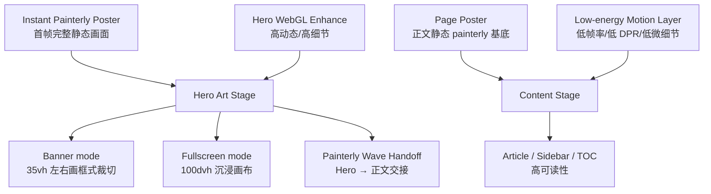

# Katelya Painterly Engine V2.1 — Hero Restoration & Instant First Paint

日期：2026-08-10
基线：`0c0df12c960fed16db0a5f427e689a0320c73c39`
工作分支：`feat/painterly-v2-1-hero-restoration`

## 结论

采用方案 A：**首页 Hero 保留最强、最精细的动态梵高式油画表达；进入正文后，同一色彩语言继续存在，但背景主动降噪，主要由高质量静态 painterly poster + 极弱动态增强承担。**

目标不是恢复旧版轮播图，而是恢复“横图 / 全屏 / 正文”三种空间层级，并把当前的首帧粗糙、WebGL 后到、波浪消失、Hero 与正文同质化的问题统一解决。

## 当前根因

### 1. Banner 视觉所有权被错误清空

`impasto-backdrop.css` 当前把 `#banner-wrapper` 强制透明、Banner 图片透明，并直接隐藏 `#header-waves`。因此 Banner 组件虽然仍渲染图片和波浪 DOM，但最终视觉上只剩同一张全屏 Canvas 与 Hero 文案。

结果：
- 横图模式不再像横图；
- fullscreen 与 banner 只剩高度差异；
- 波浪存在于 DOM，但被 V2 样式永久关闭；
- Banner 图片仍被 eager/high-priority 下载，却不可见，浪费首屏带宽。

### 2. 首帧 fallback 与最终画面不是同一幅画

当前 cold boot 先显示 `--impasto-boot-underpaint` 的简单渐变，再异步 import renderer、初始化 WebGL2、编译 shader、上传 field texture、绘制首帧，完成后直接切换 Canvas。

这造成：
- F5 时先出现“简化壁纸”；
- 然后突然变成复杂笔触；
- 较慢设备上这段切换时间明显；
- 用户感知到的是“加载很慢”，即使网络资源本身不大。

### 3. WebGL 被错误地当成首屏完整性依赖

当前单 Canvas 固定铺满整个 viewport，既承担 Hero，也承担正文背景；正文阅读区只是 shader 中的 calm zone，并没有真正把 Hero 动态预算与正文动态预算拆开。

结果：
- Hero 缺乏专属构图；
- 正文持续支付高质量背景的 GPU 成本；
- 手机 / iPad 低质量档仍然从较重 shader 启动；
- Banner 与 fullscreen 无法通过独立画面裁切建立明显空间感。

## 设计原则

1. **首屏必须完整，不等待 WebGL 才“变好看”。**
2. **Hero 与正文必须是两种能量等级，而不是同一背景的不同高度。**
3. **Banner 是“画框”，Fullscreen 是“沉浸画布”，正文是“安静纸面”。**
4. **WebGL 是增强层，不是首屏占位层的替代品。**
5. **同一艺术语言跨 PC / iPad / 手机保持一致，但允许性能等级不同。**
6. **恢复波浪时不回退到旧玻璃感；波浪必须作为 Hero → 正文的过渡笔触。**
7. **不增加运行时大图片依赖，不恢复旧版高优先级无效 Banner 下载。**

## 视觉架构

## 组件职责

### A. Instant Painterly Poster

首屏直接使用与最终 WebGL 同构图语言的 painterly poster，不再使用简单 radial/linear gradient 作为正常启动画面。

要求：
- day/night 各一套；
- 由现有 impasto SVG / generator 体系演进，不新增高分辨率 JPG/PNG；
- 首帧即包含主要色块、方向笔触、少量金色事件与 Hero calm zone；
- `impasto-ready` 前后只允许微弱的纹理增强差异，不允许整幅画“换一张”。

### B. Hero Art Stage

Hero 单独拥有高能绘画层。WebGL 不再简单等同于全页背景，而应通过 Hero mask / region energy 让首页顶部的动态最强。

Banner mode：
- 保持约 35–40vh 的“横向画框”感觉；
- Hero 画面用独立的 vertical crop / energy profile；
- 文字、orbit cards 与笔触共同构图；
- 底部恢复过渡波浪。

Fullscreen mode：
- 使用 100dvh；
- 背景允许更多外围旋涡与 broken-colour；
- Hero 内容保持中央 calm zone；
- 正文从 Hero 尾部自然上接，不用硬切背景。

### C. Painterly Wave Handoff

恢复 `#header-waves`，但从“普通 SVG 水波纹”转译为油画交接层。

实现方向：
- 继续复用现有轻量 SVG path；
- 不重新引入复杂 filter；
- 颜色由 `--page-bg` 与 painterly palette 混合；
- 4 层波浪透明度更克制，速度降低；
- light / dark 分别采用暖纸白 / 深靛蓝交接；
- reduced-motion 保留静态波形，不运行 parallax。

### D. Content Stage

正文区不再持续使用 Hero 级别的完整动态。

正文背景由两层组成：
1. 高质量静态 painterly poster，保证视觉连续；
2. 极弱动态增强，只在支持 WebGL 且设备预算允许时开启。

正文动态约束：
- idle 4–8 FPS；
- DPR 上限显著低于 Hero；
- 禁止 pointer-driven 大幅响应；
- 禁止完整 micro bristle；
- 阅读中央区域保持极低能量；
- 页面滚动时不因为 Canvas resize/重绘造成卡顿。

## 首帧策略

### 目标

从 HTML/CSS 第一次 paint 起，用户看到的就是“已经完成的 Katelya 油画背景”。WebGL 只增加细微动态与光照，不承担视觉补全。

### 启动阶段

1. HTML 解析：poster 立即可见。
2. CSS ready：Hero /正文已有正确色彩和构图。
3. `requestAnimationFrame` 后按优先级加载 Hero renderer。
4. 首个 WebGL frame 完成后，使用 140–180ms 的纹理交叉融合。
5. 正文低能耗增强延迟到首屏稳定、`requestIdleCallback` 或短 timeout 后初始化。

### 禁止事项

- 正常启动不得先显示纯渐变 placeholder；
- 不允许 WebGL ready 后 `transition:none` 硬切；
- 不允许隐藏 poster 后才发现 Canvas 仍未完成；
- 不允许把 Banner 图片设为 eager/high priority 后再 CSS 隐藏。

## Renderer 预算

### Hero renderer

Desktop：
- 初始 quality：MEDIUM-FIRST，而不是 HIGH-FIRST；
- 首帧 DPR 约 0.85–1.0；
- 首帧稳定后，若帧成本足够低再升级 HIGH；
- pointer active 最高 42–48 FPS；
- idle 10–12 FPS。

Touch / iPad / Mobile：
- 初始 LOW/MEDIUM-FIRST；
- DPR 0.55–0.85；
- pointer/touch 不触发完整微细节；
- idle 6–10 FPS。

### Content renderer

- Desktop DPR 上限约 0.75；
- Touch DPR 上限约 0.55–0.65；
- idle 4–8 FPS；
- `uMicroDetail` <= 0.25；
- 只保留 broad/mid 的慢速内部生命感。

### Quality governor

V2 现有 governor 保留 EMA/hysteresis 思路，但升级为“启动质量 + 运行质量”两阶段：
- 首屏阶段优先快速首帧；
- 运行阶段再根据真实帧成本升级；
- 不再等待 36 samples / 8 秒后才有第一次性能修正。

## Banner 图片与旧组件处理

现有 `Banner.astro` 仍承担：
- Banner DOM 容器；
- page overlay；
- wave DOM；
- credit；
- 壁纸模式兼容。

但在 Katelya art theme 下：
- 旧 banner 图片不再参与首屏主视觉；
- 不再 eager/high-priority 下载不可见图片；
- carousel / Ken Burns 在艺术主题下不应占用首屏资源；
- 这些能力保留给非 Katelya art theme 或未来 fallback，而不是删除底层通用组件。

## 响应式

### Desktop >= 1280

- Banner：明确 35–40vh 横向画框；
- Fullscreen：100dvh；
- 4 个 orbit cards 保留；
- wave handoff 完整；
- Hero renderer 可升级 HIGH。

### iPad / 768–1279

- 同一 painterly poster 和 WebGL 风格；
- 不是 SVG-only 降级；
- 保留 4 cards，但缩小轨道与深度；
- banner portrait 约 58–70svh；
- fullscreen 100dvh；
- renderer 初始 MEDIUM/LOW，稳定后可升级。

### Mobile < 768

- 首页仍有完整动态 Hero，不再只看到静态 SVG；
- orbit cards 可继续隐藏，保留标题 + 快捷入口；
- poster 首帧完整；
- WebGL 为低预算增强；
- 非首页继续优先正文，不强塞 Hero。

## 明暗主题

Light：
- teal / viridian / warm cream / restrained violet；
- Hero 外围金色 pigment event 稍明显；
- 正文背景降低饱和度与对比度。

Dark：
- ultramarine / cobalt / petrol / violet；
- 黄色只作少量高能事件；
- 正文动态更弱，避免夜间阅读干扰。

主题切换：
- poster 与 Canvas 同步切换；
- 不重建整个 Canvas；
- 仅触发短暂 theme burst；
- 禁止出现白闪/蓝闪。

## 性能与加载

必须优化：
- 取消 Katelya art theme 下不可见 Banner 图片的首屏高优先级请求；
- renderer bundle 与 hero-depth 分离优先级，Hero renderer 先，depth 后；
- 避免 `Promise.all` 让 hero-depth 阻塞 renderer 初始化；
- poster 由 CSS/SVG 立即绘制；
- 首帧 shader 使用低成本配置；
- 正文 renderer 延迟启动；
- 不新增运行时依赖。

预期目标不是伪造 Lighthouse 分数，而是建立可验证的行为目标：
- 首帧无明显 placeholder 跳变；
- WebGL 第一帧出现时视觉差异很小；
- Banner / fullscreen 切换即时，无 reload；
- 手机/iPad 不因背景造成明显滚动掉帧；
- 静态 fallback 与动态版本保持同一艺术构图。

## 测试与验收

### 自动化

新增/更新：
- `impasto-cold-boot`：延迟 renderer 时 poster 已是完整 painterly 画面；
- `hero-mode-ownership`：banner/fullscreen 具有不同 Hero geometry；
- `waves-restoration`：waves 在 art theme 可见，配置关闭仍生效；
- `banner-network-priority`：art theme 不产生不可见 eager banner 请求；
- `painterly-runtime-budget`：首帧 quality、touch DPR、content low-energy budget；
- `responsive-matrix`：desktop / iPad / mobile × light/dark × banner/fullscreen；
- reduced-motion / save-data fallback。

### 视觉验收

固定截图：
- Home desktop light/dark banner；
- Home desktop light/dark fullscreen；
- Home iPad portrait / landscape；
- Home mobile portrait / landscape；
- Article desktop light/dark；
- Article iPad/mobile；
- cold boot 首帧与 WebGL ready 后对照。

人工检查：
- Hero 第一眼是否明显是“画面主体”；
- Banner 是否有清晰横图裁切感；
- Fullscreen 是否明显更沉浸；
- 波浪是否自然连接正文；
- 首帧是否不再粗糙；
- 正文是否安静且滚动流畅；
- light/dark 是否属于同一品牌而非两套主题。

## 不在本次范围

- 不改文章内容、文章结构、分类、标签、资料页内容；
- 不重构 TOC reading rail；
- 不重做音乐播放器；
- 不修改备案、域名、Cloudflare Pages、多吉云 CDN 工作流；
- 不引入 Three.js、Pixi、GSAP 或新的 WebGL 框架；
- 不恢复旧 Banner 图片作为 Katelya art theme 的主要视觉。

## 成功标准

V2.1 达标必须同时满足：

1. 刷新时第一屏直接是高完成度 painterly Hero，不再先闪粗糙渐变。
2. Banner 与 Fullscreen 视觉差异显著，不只是高度差异。
3. 波浪恢复，并承担 Hero → 正文交接作用。
4. PC、iPad、手机均使用同一艺术语言；性能差异只体现在细节等级。
5. 正文背景明显比 Hero 安静，长文滚动流畅。
6. 不再高优先级下载被 CSS 隐藏的旧 Banner 图。
7. 现有导航、TOC、音乐、Swup、主题切换、壁纸模式不回归。
8. 所有静态检查、构建、单元测试、Playwright 与 Cloudflare Pages CI 通过后才允许合并。