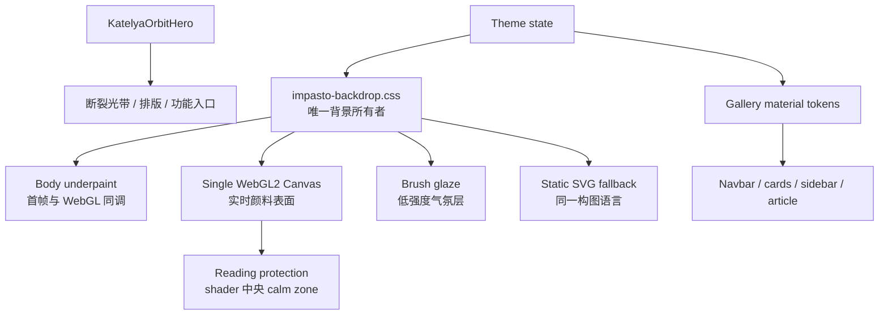

# Katelya Painterly Engine V2 设计说明

日期：2026-08-10
真实基线：`75dfba913152232e16c6ea958d8d1c6292476da4`
工作分支：`feat/van-gogh-painterly-engine-v2`

## 目标与边界

本次升级不是给博客增加“梵高主题装饰”，也不复制任何具体名画的构图。目标是让 Katelya 的页面本身成为一块仍有生命的数字油画表面：色彩先被看见，方向性笔触组织情绪，颜料脊线只在光线变化时被发现；越接近正文，视觉噪声越少。

明确不修改：文章与个人资料、音乐歌单、备案信息、Cloudflare/CDN 部署、内容同步、导航信息架构、adaptive desktop TOC reading rail，以及既有桌面/触控 DPR、像素和 FPS 上限。

## 研究依据与转译

- [Van Gogh Letters 497](https://vangoghletters.org/en/let497) 将颜色描述为互相穿插、会“振动”的线，而非预先混成死灰；这成为 broken colour 和离散色邻接的依据。
- [Van Gogh Letters 494](https://vangoghletters.org/vg/letters/let494/print.html) 讨论互补色并置会互相增强、混合则会彼此抵消；因此 shader 让 violet/yellow、blue/orange、teal/cream 相邻，而非先全部 mix 成中间色。
- [MoMA: The Starry Night](https://www.moma.org/collection/works/79802) 说明短笔触、厚涂表面与“安静村庄/运动天空”的对比；本项目转译为平静阅读区和高能外围，而不是复制星月、柏树或天空布局。
- [MoMA: Starry Night in 3D](https://www.moma.org/magazine/articles/462) 强调 impasto 的山脊和谷地会随照明显现；因此高度来自离散笔触实体、边缘和鬃毛脊，而非大尺度 FBM。
- [The Met: Van Gogh's Cypresses](https://www.metmuseum.org/pt/exhibitions/van-gogh-cypresses/visiting-guide) 将表现性色彩、反自然线条与丰富厚涂联系起来；本项目保留不对称区域偏置和方向张力，同时删除符号化柏树图标。
- [Van Gogh Museum permanent collection text](https://www.vangoghmuseum.nl/assets/08306c43-0b82-4904-bcec-0afb7748b1dc/assignment-sheet-dark-to-light-secondary-education-van-gogh-museum) 提醒笔触的点、划和色彩对比是结构语言；因此 V2 的三尺度不是三层普通噪声，而是三类不同职责的笔触。

提炼出的项目原则：

1. 方向比旋转更重要：局部力量传递取代全图统一流动。
2. 色彩并置比预混更重要：让眼睛完成混色，保留色彩能量。
3. 高度应属于颜料实体：法线不应暴露程序噪声。
4. 节奏必须有快慢：中央平静，外围更密、更厚、更有方向性。
5. 光只揭示表面：指针是微小的观画角度变化，不是背景控制器。
6. 不完美必须受控：不规则、断裂和不对称服务于构图，不能损害可读性。
7. 夜色由许多蓝构成：ultramarine、cobalt、petrol 和 violet 并置，黄色只做稀少能量事件。

## 背景所有权

`katelya-impressionist.css` 的旧壁纸、旧 Hero 几何和 banner 底色曾在生产 CSS 中覆盖 Canvas，形成硬接缝；该入口现在只保留退役说明。`katelya-van-gogh-gallery.css` 负责功能表面材质，`katelya-van-gogh-safety.css` 只负责安全/可读性，不再拥有 body 背景。没有新增 repair CSS，也没有用更高 specificity 继续叠补丁。

## 关键变化

### 1. 等高线感

**Problem**：structure tensor 与 ridge FBM 连续支配最终几何，画面首先呈现地形等高线。
**Visual principle**：先看到颜色和离散笔触，再通过光发现颜料高度。
**Technical solution**：tensor 降级为弱方向倾向；最终方向叠加 local curl、非镜像 vortex、平滑 region bias 和异步 phase。高度主要来自 `midStrokeMask` 的 body/edge、`microBristleRidge` 与少量 pigment deposit。
**Performance cost**：renderer bundle 增加 3,219 bytes；新增 shader 算术但没有纹理、FBO 或依赖。
**Verification**：真实 Chrome WebGL2 编译通过；Painterly V2 行为测试验证三尺度、弱 tensor、height 来源和读区 calm zone；before/after 人工视觉复核确认不再由连续 ridge 主导。

### 2. 三尺度笔触

**Problem**：多个噪声频段仍会被感知为同一程序纹理。
**Visual principle**：底绘、主要笔触和鬃毛高光必须承担不同任务。
**Technical solution**：`broadUnderpainting` 只组织慢速大色域；`midStrokeMask` 生成不等长、断裂、局部弯曲的主要笔触；`microBristleRidge` 只进入高度/光照，并受质量级别控制。
**Performance cost**：HIGH 保留全部微细节；MEDIUM/LOW 逐级降低 micro detail 与 DPR，不改变整体配色或构图。
**Verification**：shader 单元回归、真实 GPU 截图、HIGH/MEDIUM data attribute 和触控像素预算断言。

### 3. 异步内部生命感

**Problem**：`uv + time * constant` 会让整张纹理像 GIF 平移。
**Visual principle**：运动来自局部颜料内部，而不是画布整体漂移。
**Technical solution**：不同 region 使用不同 phase velocity，vortex 中心缓慢漂移，local advection 与 domain warp 不共享统一速度；阅读区同时降低速度和 coherence。
**Performance cost**：维持原有 14/10 idle FPS 和 48/30 pointer FPS，不新增常驻动画循环。
**Verification**：源码回归禁止统一全局平移模式；艺术系统持续 `requestAnimationFrame` 循环仍为 1 个，Hero depth 为事件驱动。

### 4. Hero 几何与深度

**Problem**：规则 ellipse aura、双环和分散 pointer handler 让 Hero 像太阳系 UI。
**Visual principle**：能量应该是断裂、锥形、不对称的手绘光带；深度只用于层次，不用于炫技。
**Technical solution**：四条不连续 aura stroke 取代圆环；引入统一 depth tokens；`hero-depth.ts` 只计算一组 pointer CSS variables，不在 pointermove 读取布局或修改几何；卡片采用不同深度、非对称圆角和高光位移。
**Performance cost**：连续交互仅更新 transform/opacity/CSS variables；触控和 reduced-motion 不运行 pointer depth。
**Verification**：E2E 验证不存在规则 aura ring、标题/卡片/链接无碰撞、iPad/desktop 保留四卡、手机为零布局盒。

### 5. 功能表面材质

**Problem**：旧 CSS 将 navbar、卡片和正文统一成高 blur 的毛玻璃组件库。
**Visual principle**：艺术性集中在底层，功能表面像不同温度和厚度的纸/底漆，正文最安静。
**Technical solution**：建立 warm/cool paper、edge highlight 和 functional ink tokens；减少 blur、统一高抬升 hover 与重阴影；文章、侧栏和卡片用克制的局部色温区分。
**Performance cost**：减少部分 backdrop-filter；没有新增全屏 filter 或 SVG filter。
**Verification**：全页截图检查 navbar、post cards、sidebar、calendar、article；既有 navigation/overlay 回归仍作为最终 gate。

### 6. 自适应质量

**Problem**：只按设备宽度分档不能覆盖真实 GPU 差异。
**Visual principle**：低质量仍是同一幅画，只少一点微细节。
**Technical solution**：HIGH/MEDIUM/LOW 使用帧成本 EMA；20ms 以上连续样本降级，11ms 以下连续样本升级，至少 36 个样本且切换冷却 8 秒；质量变化只调整 DPR scale 和 micro detail。
**Performance cost**：每帧增加常数级统计；只有真正切级时 resize，避免闪烁和抖动。
**Verification**：质量 governor 单元测试和浏览器 data attribute；desktop 初始 HIGH、touch 初始 MEDIUM，Canvas 尺寸不超过既有预算。

### 7. 静态 fallback

**Problem**：规则 Bézier band、圆形 halo、UI frame 和符号化植物让 fallback 像另一套低质量画面。
**Visual principle**：fallback 是同一艺术系统的静止版本，而非故障占位图。
**Technical solution**：降低 tensor 支配，增加不均匀笔触长度/聚类、断裂光带、中央 calm zone 和外围 pigment event；移除圆 halo、UI outer frame 以及图标式 cypress/iris。
**Performance cost**：day SVG +2,214 bytes，night SVG +7,834 bytes；仍无运行时图片依赖。
**Verification**：生成器测试、SVG 元素约束、cold-boot delayed-JS Playwright 和 palette/composition 人工复核。

## 响应式与可访问性

原有 `katelya-responsive-hero.css` 没有推倒重做，只对 stage 和四卡边界做定向修正。15 个真实视口分别执行 light/dark × banner/fullscreen，共 60 种状态；断言标题、四卡、快捷入口、navbar、Hero/正文交接、Canvas 预算和横向溢出。手机不依赖 hover、DeviceOrientation 或陀螺仪；`prefers-reduced-motion` 停止持续 3D 与 aura 动画。TOC 继续使用共享 `--impasto-header-top` / `--impasto-header-height`，没有回退到 `top-14`。

## 已知权衡

- 更丰富的 shader 让 renderer chunk 增加 18.8%，但全站 JS 仅增加 0.14%，且没有新增网络依赖。
- fallback SVG 稍大，换取与 WebGL 一致的笔触和读区；它仍远小于高分辨率位图方案。
- Canvas 截图受时间相位影响，不做脆弱的全图像素阈值；自动化优先验证几何、可见性、所有权和 cold boot，视觉质量由固定场景 before/after 人工复核。
- 本地 preview 的请求数是单次观察值，不等同于真实 CDN 环境；没有伪造 Lighthouse、LCP、CLS 或 INP 数字。
